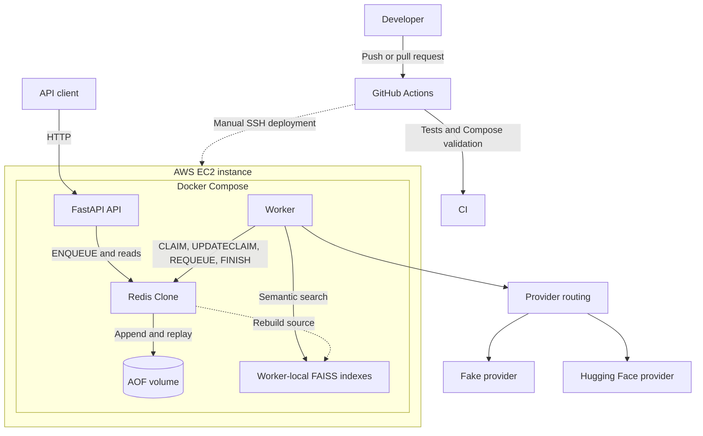
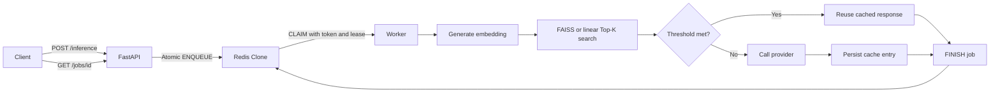
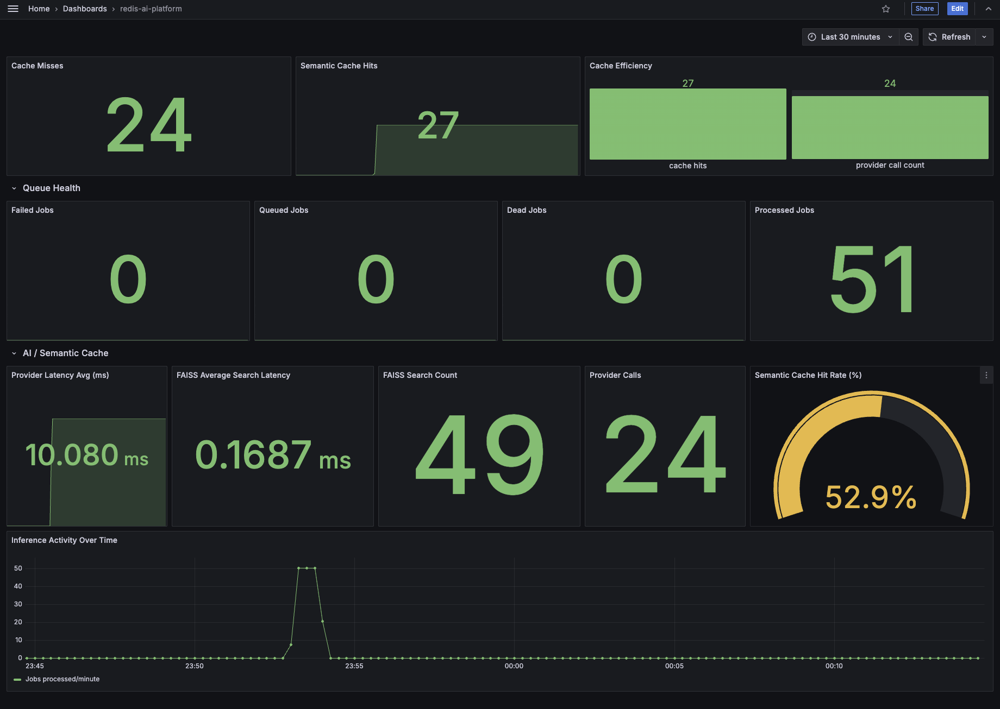

# Mini Redis AI Infrastructure Platform

A Redis-inspired AI inference platform built from first principles, combining
a custom TCP datastore, durable worker queue, semantic caching, FAISS vector
search, production-style observability, CI/CD, and AWS deployment.

## Project Highlights

- Built a concurrent TCP datastore with RESP parsing, TTL expiration, atomic
  commands, strict request limits, and append-only persistence.
- Designed a durable multi-worker queue with token-protected claims, leases,
  heartbeats, retries, stale-claim recovery, and at-least-once delivery.
- Implemented model-isolated semantic caching with Hugging Face embeddings and
  worker-local FAISS indexes rebuilt from Redis state.
- Added Prometheus metrics, a Grafana dashboard, structured JSON logging, and
  `request_id`/`job_id` correlation across asynchronous execution.
- Split API, datastore, and worker dependencies into separate Docker images;
  heavy ML dependencies remain worker-only.
- Automated validation and EC2 deployment with GitHub Actions and Docker
  Compose.
- Validated the system with a 170-test suite (165 passing and 5
  environment-dependent tests skipped) and a deployed 46-request workload:
  56.5% cache hits, 26 provider calls avoided, zero false-positive cache hits,
  and zero failed or dead jobs.

## Architecture



Redis Clone and its AOF are the durable source of truth. FAISS is a
worker-local acceleration layer that can be discarded and rebuilt.

[Read the detailed architecture](architecture.md)

## Request Lifecycle



The API only validates and enqueues work. Workers own embedding generation,
vector search, provider execution, semantic-cache updates, and job completion.

## Observability Dashboard

The Grafana dashboard presents queue health, cache effectiveness, provider
usage, FAISS activity, search latency, and inference activity.

[](docs/diagrams/images/grafana-semantic-cache-dashboard.png)

## Proof It Works

| Deployment validation | Result |
|---|---:|
| Requests completed | 46 / 46 |
| Semantic cache hit rate | 56.5% |
| Provider calls avoided | 26 |
| Negative-control false positives | 0 |
| Exact-repeat misses | 0 |
| Failed/dead jobs | 0 |

The benchmark reused cached responses for 26 requests and reduced provider
execution to 20 calls while preserving conservative threshold behavior.

The validation workload included:

- 6 canonical seed prompts
- 18 semantic paraphrases
- 12 exact repeats
- 4 unrelated negative controls
- 6 requests submitted as a queue burst

Run the same workload:

```bash
python3 benchmarks/demo_semantic_cache.py \
  --base-url http://localhost:8000 \
  --provider huggingface
```

The script prints matched prompts, similarity scores, hit/miss latency
statistics, metric deltas, semantic misses, and correctness failures.

This is a functional deployment demonstration, not a throughput or capacity
benchmark. Results depend on existing cache state, the embedding model, and
`SEMANTIC_CACHE_THRESHOLD`.

## Quick Start

### Requirements

- Docker
- Docker Compose
- Enough memory and disk for the worker's CPU-only PyTorch, sentence
  transformer, and FAISS dependencies

### Start the Stack

```bash
git clone https://github.com/FabRamon13/mini-redis-ai.git
cd mini-redis-ai
docker compose up --build
```

The first worker startup may take longer while model assets are downloaded.

Local endpoints:

| Service | URL |
|---|---|
| FastAPI | `http://localhost:8000` |
| API documentation | `http://localhost:8000/docs` |
| Prometheus | `http://localhost:9090` |

### Submit an Inference Job

```bash
curl -X POST http://localhost:8000/inference \
  -H "Content-Type: application/json" \
  -d '{"prompt":"what is semantic caching","provider":"huggingface"}'
```

The API returns a job ID:

```json
{
  "job_id": "uuid",
  "status": "queued",
  "type": "inference"
}
```

Poll the result:

```bash
curl http://localhost:8000/jobs/<job_id>
```

Inspect health and metrics:

```bash
curl http://localhost:8000/health
curl http://localhost:8000/jobs/metrics
curl http://localhost:8000/metrics
```

## Technical Deep Dive

### Redis Clone

The datastore implements TCP client/server communication, RESP-style framing,
thread-safe command dispatch, key/value and list data structures, TTLs,
atomic counters, and queue-specific commands. Protocol limits reject oversized
bulk strings and arrays before they can consume unbounded memory.

<details>
<summary>Supported commands</summary>

```text
GET SET DELETE FLUSH
MGET MSET
EXISTS TTL
LPUSH RPOP LLEN LRANGE LREM RPOPLPUSH
INCR INCRBY
ENQUEUE CLAIM UPDATECLAIM REQUEUE ACK FINISH
EXPIREAT
```

</details>

[Datastore and service responsibilities](architecture.md#service-responsibilities)

### Persistence

Every mutating command is encoded in RESP and appended to an AOF. Startup
replay reconstructs key/value data, lists, TTLs, queue claims, terminal job
state, and metrics. Absolute expiration timestamps prevent TTLs from resetting
after a restart, while replay mode prevents duplicate AOF writes.

[Persistence design](architecture.md#persistence-and-recovery)

### Durable Worker Queue

`ENQUEUE` atomically checks queue capacity, stores job metadata, and pushes the
job ID. `CLAIM` moves work into `processing_jobs` while creating a UUID claim
token and lease. Heartbeats refresh active claims; expired claims are recovered
and requeued. `FINISH`, `REQUEUE`, `ACK`, and `UPDATECLAIM` reject stale or
missing claim tokens.

Delivery is at least once, so handlers must remain idempotent. Long-running
jobs use lease heartbeats but may still execute twice during failure races.

[Queue lifecycle and recovery](architecture.md#queue-architecture)

### Semantic Cache

Workers embed prompts and search compatible cache records before calling the
response provider. Entries are isolated by provider, model ID, model revision,
and embedding dimensions. UUID entry IDs avoid key collisions; duplicate
entries are skipped and oldest entries are pruned to keep the cache bounded.

The similarity threshold and maximum cache size are environment configurable.

[Semantic cache architecture](architecture.md#semantic-cache-architecture)

### FAISS Vector Search

The worker can use either linear cosine search or exact FAISS `IndexFlatIP`
search. Vectors are normalized so inner product represents cosine similarity.
Separate indexes are maintained for each provider/model/revision/dimension
signature.

Redis remains authoritative for prompts, responses, metadata, and embeddings.
Each worker rebuilds its FAISS indexes from Redis on startup and incrementally
adds new cache entries after misses.

[Vector search and rebuild strategy](architecture.md#vector-search)

### Observability

Runtime visibility includes:

- Prometheus-compatible metrics at `GET /metrics`
- Human-readable JSON metrics at `GET /jobs/metrics`
- Grafana panels for queue and semantic-cache behavior
- Structured JSON logs from the API, worker, and Hugging Face provider
- Correlated `request_id`, `job_id`, and `worker_id` fields
- Docker `json-file` log rotation

Tracked measurements include queue depth, processed/failed/dead jobs, semantic
hits and misses, provider calls and latency, and FAISS/linear search counts and
latency.

Sensitive values such as claim tokens, prompts, embeddings, responses,
passwords, API keys, and secrets are redacted or excluded from logs.

[Metrics and logging architecture](architecture.md#metrics-and-logging-architecture)

## API Surface

| Method | Endpoint | Purpose |
|---|---|---|
| `GET` | `/health` | API and datastore health |
| `POST` | `/inference` | Validate and enqueue inference |
| `GET` | `/jobs/{job_id}` | Read job status and result |
| `GET` | `/jobs/metrics` | JSON operational metrics |
| `GET` | `/metrics` | Prometheus exposition format |
| `GET` | `/jobs/dead/count` | Dead-letter queue count |

Inference requests accept prompts from 1 to 1,000 characters and restrict
providers to `fake` or `huggingface`.

## Testing and CI

The latest local validation completed:

```text
170 tests run
165 tests passed
5 environment-dependent integration tests skipped
```

Coverage includes protocol boundaries, AOF replay, TTL persistence, atomic
queue operations, concurrent claims, leases and heartbeats, semantic-cache
filtering, FAISS rebuilds, metrics, structured logging, and API validation.

Run the validation pipeline:

```bash
python -m unittest discover -s tests -v
python -m compileall -q \
  redis_clone worker fastapi_cache ai providers observability tests benchmarks
docker compose config
docker compose -f docker-compose.prod.yml config
```

GitHub Actions runs dependency installation, compilation, tests, and Compose
validation on every push and pull request.

## Deployment

The platform is deployed to a single AWS EC2 instance running Ubuntu and
Docker Compose. A manually triggered GitHub Actions workflow:

1. Connects to EC2 over SSH.
2. Pulls the latest `main` branch with `--ff-only`.
3. Rebuilds the service images.
4. Recreates the Compose stack.
5. Polls `/health` and prints service logs if deployment fails.

Production boundaries:

- Redis Clone is only available inside the Docker network.
- FastAPI is exposed on port `8000`.
- Prometheus and Grafana bind to loopback and are accessed through SSH
  forwarding.
- Redis data, Prometheus data, and Grafana state use named volumes.
- API and Redis images do not install worker-only ML dependencies.
- Application services and Prometheus use restart policies; all services use
  size-limited Docker logs.

[Deployment and trust boundaries](architecture.md#deployment-and-trust-boundaries)

## Configuration

Important environment variables:

| Variable | Default | Purpose |
|---|---:|---|
| `REDIS_HOST` | `127.0.0.1` | Redis Clone host |
| `REDIS_PORT` | `31337` | Redis Clone TCP port |
| `SEMANTIC_CACHE_THRESHOLD` | `0.75` | Minimum cache-hit similarity |
| `SEMANTIC_CACHE_MAX_ENTRIES` | `1000` | Semantic cache retention limit |
| `VECTOR_SEARCH_ENGINE` | `faiss` | `faiss` or `linear` |
| `WORKER_LEASE_SECONDS` | `60` | Claim lease duration |
| `WORKER_RECOVERY_INTERVAL_SECONDS` | `30` | Stale-claim scan interval |
| `WORKER_HEARTBEAT_INTERVAL_SECONDS` | `15` | Lease heartbeat interval |

## Repository Layout

```text
redis_clone/       TCP datastore, protocol, client, persistence, queue commands
fastapi_cache/     HTTP API, validation, health, and metrics exposition
worker/            Job lifecycle, semantic cache, and FAISS index management
ai/                Embeddings, similarity, linear search, and FAISS store
providers/         Fake and Hugging Face provider implementations
observability/     Shared structured JSON logging
tests/             Unit and integration tests
benchmarks/        Vector benchmarks and deployed semantic-cache demo
docs/diagrams/     Editable Mermaid sources and dashboard image
prometheus/        Prometheus scrape configuration
```

## Current Limitations

- Educational Redis implementation, not a replacement for production Redis
- No authentication, authorization, or TLS
- No AOF rewrite/compaction, snapshots, replication, clustering, or sharding
- Queue guarantees at-least-once rather than exactly-once delivery
- Semantic cache record creation and index insertion are not one atomic command
- FAISS indexes are worker-local and eventually consistent across workers
- Single-host EC2 deployment without load balancing or high availability
- No Prometheus alert rules or centralized log shipping
- No automated deployment rollback
- Docker images are rebuilt on the target host

These constraints are documented deliberately; the project focuses on
durability, recoverability, clear ownership boundaries, and observability
rather than production Redis compatibility or horizontal scale.

## Technology

| Area | Tools |
|---|---|
| Backend | Python, FastAPI, gevent |
| AI | Sentence Transformers, Hugging Face, FAISS |
| Storage | Custom Redis-inspired datastore, AOF |
| Infrastructure | Docker, Docker Compose, AWS EC2 |
| Observability | Prometheus, Grafana, structured JSON logs |
| Delivery | GitHub Actions |
| Testing | `unittest`, integration tests, benchmark tooling |
