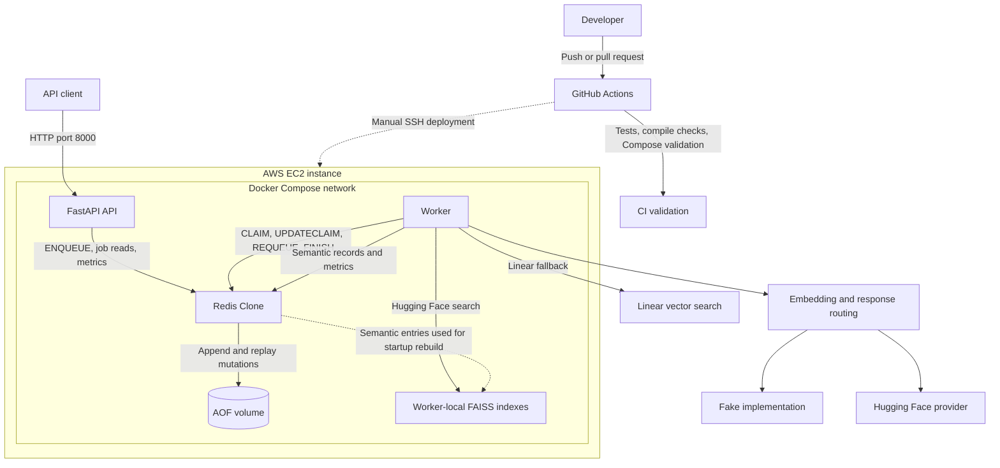

# Mini Redis AI Infrastructure Platform

## Overview

Mini Redis AI Infrastructure Platform is a backend systems and AI infrastructure project built from first principles.

The project began as a Redis-inspired TCP key-value store written in Python and evolved into a distributed AI inference and semantic caching platform featuring durable job processing, lease-based worker coordination, semantic caching, vector search, observability, cloud deployment, and automated testing.

The system demonstrates concepts commonly found in backend, platform, and AI infrastructure engineering:

* Custom TCP networking
* RESP protocol parsing
* Durable persistence
* Distributed job processing
* Lease-based worker coordination
* Semantic caching
* Vector search
* AI inference routing
* Observability and metrics
* Continuous Integration
* Deployment workflows


---

# Architecture



For detailed system architecture, inference request flow, queue lifecycle,
data ownership, persistence, and deployment diagrams, see
[architecture.md](architecture.md).

---

# Core Features

## Redis Clone

* TCP client/server architecture
* RESP-style protocol parser
* Command dispatch layer
* Thread-safe shared state
* Concurrent client handling
* Key-value storage
* TTL expiration
* AOF persistence
* Startup replay
* Atomic counters

### Supported Commands

```text
GET
SET
DELETE
FLUSH

MGET
MSET

EXISTS
TTL

LPUSH
RPOP
LLEN
LRANGE
LREM

INCR
INCRBY

ENQUEUE
CLAIM
UPDATECLAIM
REQUEUE
ACK
FINISH
```

---

# Persistence

All mutating commands are written to an append-only file.

```text
SET
MSET
DELETE
LPUSH
CLAIM
FINISH
INCR
INCRBY
...
```

During startup:

```text
Server Starts
      ↓
Read AOF
      ↓
Replay Commands
      ↓
Rebuild State
```

Redis Clone remains the durable source of truth for:

* queue state
* semantic cache entries
* metrics
* job metadata

---

# Distributed Worker Queue

The project includes a durable queue architecture inspired by systems such as:

* Celery
* Sidekiq
* BullMQ

## Queue Lifecycle

```text
Queued
  │
  ▼
Claimed
  │
  ▼
Processing
  │
  ├────► Requeue
  │
  ├────► Complete
  │
  └────► Dead Letter
```

## Reliability Features

### Claim Tokens

Every claimed job receives a unique claim token.

```text
Job
 ↓
Claim
 ↓
Claim Token
```

Only the owning worker can:

* ACK
* REQUEUE
* FINISH
* UPDATECLAIM

### Worker Leases

Workers claim jobs using time-based leases.

```text
Claim
 ↓
Lease
 ↓
Heartbeat
 ↓
Lease Extension
```

### Recovery

Stale claims are automatically recovered.

```text
Worker Crash
 ↓
Lease Expiration
 ↓
Recovery Scan
 ↓
Requeue
```

This provides at-least-once delivery semantics.

---

# AI Infrastructure Layer

Inference requests are processed asynchronously by workers.

```text
POST /inference
       ↓
Queue
       ↓
Worker
       ↓
Provider Router
       ↓
Model Provider
       ↓
Response
```

Supported providers:

* Fake Provider
* Hugging Face Provider

Provider routing allows new providers to be added without modifying worker execution logic.

---

# Semantic Cache

The semantic cache reduces repeated inference costs.

Instead of matching exact strings:

```text
Prompt A == Prompt B
```

the cache compares vector similarity:

```text
Embedding A
      vs
Embedding B
```

## Semantic Cache Flow

```text
Prompt
   ↓
Embedding Generation
   ↓
Vector Search
   ↓
Similarity Threshold
   ↓
Hit / Miss
```

Each cache entry stores:

* prompt
* provider
* model_id
* model_revision
* embedding_dimensions
* embedding
* response

Provider and model isolation prevent cross-model cache contamination.

---

# FAISS Vector Search

The project supports two search engines:

## Linear Search

```text
O(n)
```

Every cached embedding is scanned.

## FAISS Search

```text
Exact nearest-neighbor search using FAISS IndexFlatIP.
```

Embeddings are normalized before insertion, allowing cosine similarity to be computed through inner product search.

FAISS eliminates the Python-level O(n) scan while providing efficient vector retrieval and a foundation for future approximate-nearest-neighbor indexes.

### Signature Isolation

Separate FAISS indexes are maintained for:

```text
provider
model_id
model_revision
embedding_dimensions
```

This prevents incompatible embeddings from sharing indexes.

### Rebuild Strategy

Redis remains the source of truth.

FAISS is treated as an acceleration layer.

```text
Worker Startup
      ↓
Load Semantic Cache Entries
      ↓
Validate Signatures
      ↓
Rebuild FAISS Indexes
```

If FAISS indexes are lost, workers automatically rebuild them.

---

# Metrics & Observability

The observability stack includes:

* Prometheus-compatible metrics at `GET /metrics`
* A Grafana dashboard for queue health and semantic cache behavior
* Structured JSON application logs
* `request_id` and `job_id` correlation across the API and worker
* Size-based Docker log rotation

Human-readable JSON metrics remain available at `GET /jobs/metrics`.

## JSON Metrics

```http
GET /jobs/metrics
```

## Prometheus Metrics

```http
GET /metrics
```

Prometheus scrapes this endpoint and supplies the Grafana dashboard.

Tracked metrics include:

```text
processed_jobs
failed_jobs

queued_jobs
processing_jobs
dead_jobs

semantic_cache_hits
semantic_cache_misses
semantic_cache_hit_rate

faiss_search_count
faiss_search_latency_ms_avg

linear_search_count
linear_search_latency_ms_avg

provider_call_count
provider_latency_ms_avg
```

## Structured Logs

The API, worker, and Hugging Face provider emit one JSON object per application
log event to standard output. Docker captures these logs and applies size-based
rotation.

Common fields include:

```text
timestamp
level
service
event
request_id
job_id
worker_id
provider
search_engine
cache_status
duration_ms
error_type
error
```

The API stores its generated `request_id` in job metadata, allowing the same
request to be followed from `job_enqueued` through worker processing and
`job_finished` or `job_failed`.

Sensitive values such as claim tokens, prompts, embeddings, responses, and
secrets are excluded from structured logs.

View logs locally:

```bash
docker compose logs -f api worker
```

View production logs on EC2:

```bash
docker compose -f docker-compose.prod.yml logs -f api worker
```

---

# FastAPI API

## Health

```http
GET /health
```

## Inference

```http
POST /inference
```

## Job Status

```http
GET /jobs/{job_id}
```

## Metrics

```http
GET /jobs/metrics
GET /metrics
```

## Cache Invalidation

```http
DELETE /cache/users/{user_id}
```

---

# Configuration

Environment-driven configuration controls:

```text
REDIS_HOST
REDIS_PORT

SEMANTIC_CACHE_THRESHOLD

VECTOR_SEARCH_ENGINE

WORKER_LEASE_SECONDS

WORKER_RECOVERY_INTERVAL_SECONDS

SEMANTIC_CACHE_MAX_ENTRIES
```

---

# Testing

The project includes a comprehensive automated test suite covering:

* protocol parsing
* persistence and AOF replay
* TTL expiration
* queue operations
* lease recovery
* semantic cache behavior
* FAISS indexing and rebuilds
* metrics collection
* API endpoints
* worker execution flows

Validation pipeline:

```bash
python -m unittest discover -s tests -v
python -m compileall -q redis_clone worker fastapi_cache ai providers tests benchmarks
docker compose config
```


---

# CI/CD

GitHub Actions validates:

* dependency installation
* compile checks
* automated tests
* Docker Compose configuration

Every push and pull request runs the validation pipeline automatically.

---

## AWS Deployment

The platform has been deployed on AWS EC2 using Docker Compose.

Deployment stack:

```text
AWS EC2
Ubuntu Server 24.04 LTS
Docker
Docker Compose
FastAPI API
Redis Clone
Worker Service
```

Production-style Compose file:

```text
docker-compose.prod.yml
```

The production Compose setup differs from local development:

* No source-code bind mounts
* No FastAPI `--reload`
* Redis port is not exposed publicly
* Only the API port is exposed
* Services restart automatically unless stopped

Public API access is provided through the EC2 instance on port `8000`.

Health check:

```bash
curl http://<EC2_PUBLIC_IP>:8000/health
```

Example successful response:

```json
{
  "status": "healthy",
  "api": "healthy",
  "cache": "healthy"
}
```

### Deployment Verification

The deployed system was validated end-to-end:

```text
POST /inference
      ↓
FastAPI enqueues job
      ↓
Worker claims job
      ↓
Hugging Face embedding generated
      ↓
FAISS semantic search executes
      ↓
Semantic cache miss stores entry
      ↓
Similar request returns cache hit
      ↓
Metrics update
```

---

# Semantic Cache Benchmark

A mixed 46-request workload was executed against the deployed system using
[`benchmarks/demo_semantic_cache.py`](benchmarks/demo_semantic_cache.py).

The workload runs deterministic phases:

* 6 canonical seed prompts
* 18 semantic paraphrases
* 12 exact repeats
* 4 unrelated negative controls
* 6 requests submitted as a queue burst

Run it against a local or deployed API:

```bash
python3 benchmarks/demo_semantic_cache.py \
  --base-url http://localhost:8000 \
  --provider huggingface
```

## Recorded Result

| Metric | Workload Result |
|---|---:|
| Total requests | 46 |
| Completed jobs | 46 |
| Failed jobs | 0 |
| Dead jobs | 0 |
| Semantic cache hits | 26 |
| Semantic cache misses | 20 |
| Cache hit rate | 56.5% |
| Negative-control false positives | 0 |
| Exact-repeat misses | 0 |
| FAISS searches | 46 |
| Provider calls | 20 |

The result shows selective cache reuse rather than unconditional matching:

* Every request completed without entering the failed or dead-job paths.
* All exact repeats were served from cache.
* Unrelated negative controls produced no false-positive cache hits.
* Provider calls were avoided for 26 of 46 requests.
* Misses included deliberate cold seeds and negative controls, plus
  paraphrases that remained below the configured similarity threshold.
* The final burst exercised queue submission and worker claims separately
  from the sequential semantic checks.

This is a functional demonstration workload, not a throughput or capacity
benchmark. Results depend on the embedding model, existing cache contents,
and `SEMANTIC_CACHE_THRESHOLD`.

## Dashboard Snapshot After the Run

The Grafana dashboard uses cumulative counters, so its values include the
five requests that existed before this workload:

```text
processed_jobs: 51
semantic_cache_hits: 27
semantic_cache_misses: 24
semantic_cache_hit_rate: 52.9%
faiss_search_count: 49
provider_call_count: 24
failed_jobs: 0
dead_jobs: 0
```

The script also prints per-request matches and similarity scores, hit/miss
average, p50 and p95 end-to-end latency, metric deltas, and any semantic
paraphrases that did not meet the threshold.

---

# Running Locally

```bash
docker compose up --build
```

API:

```text
http://localhost:8000
```

Health Check:

```bash
curl http://localhost:8000/health
```

Prometheus:

```text
http://localhost:9090
```

---

# Current Limitations

* Educational Redis implementation, not production Redis
* No authentication, authorization, or TLS
* No AOF rewrite/compaction
* No replication or high availability
* No clustering or sharding
* No snapshot persistence
* Queue provides at-least-once delivery semantics
* Semantic cache insertion is not fully atomic
* FAISS indexes are worker-local and rebuilt on startup
* Single-worker deployment has not been validated at scale
* Prometheus and Grafana are bundled, but alerting is not configured
* No automated deployment rollback mechanism
* AWS deployment currently runs on a single EC2 instance
* Deployments require rebuilding Docker images on the target server
* No load balancing or multi-instance deployment


---

# Technology Stack

Backend:

* Python
* FastAPI
* gevent

AI:

* Hugging Face Transformers
* Sentence Transformers
* FAISS

Infrastructure:

* Docker
* Docker Compose
* GitHub Actions

Storage:

* Custom Redis-inspired datastore
* Append-only persistence

Testing:

* unittest
* integration testing
* benchmark tooling

```
```
