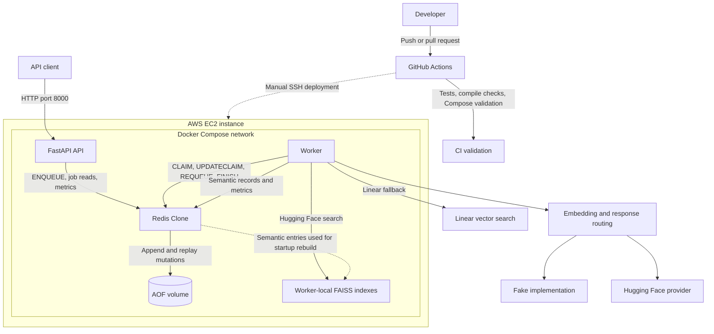
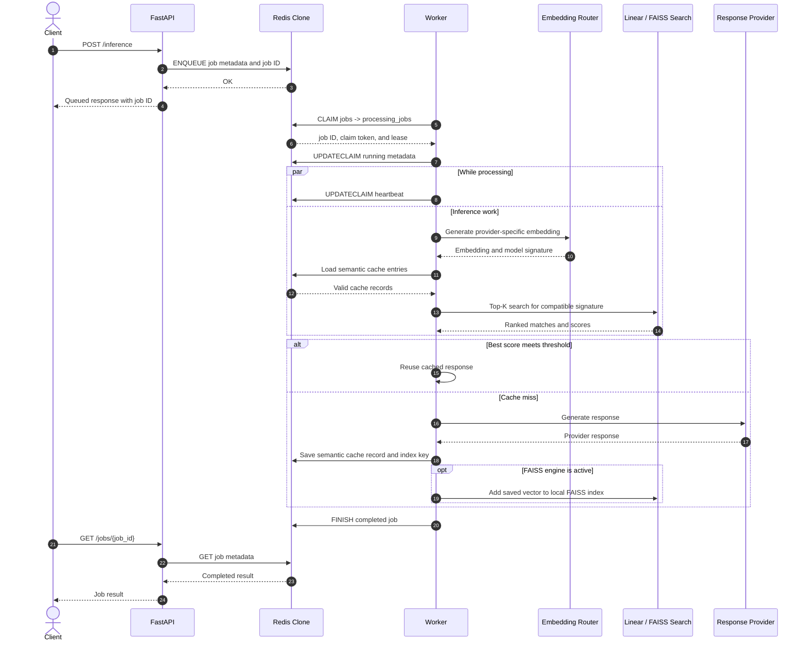
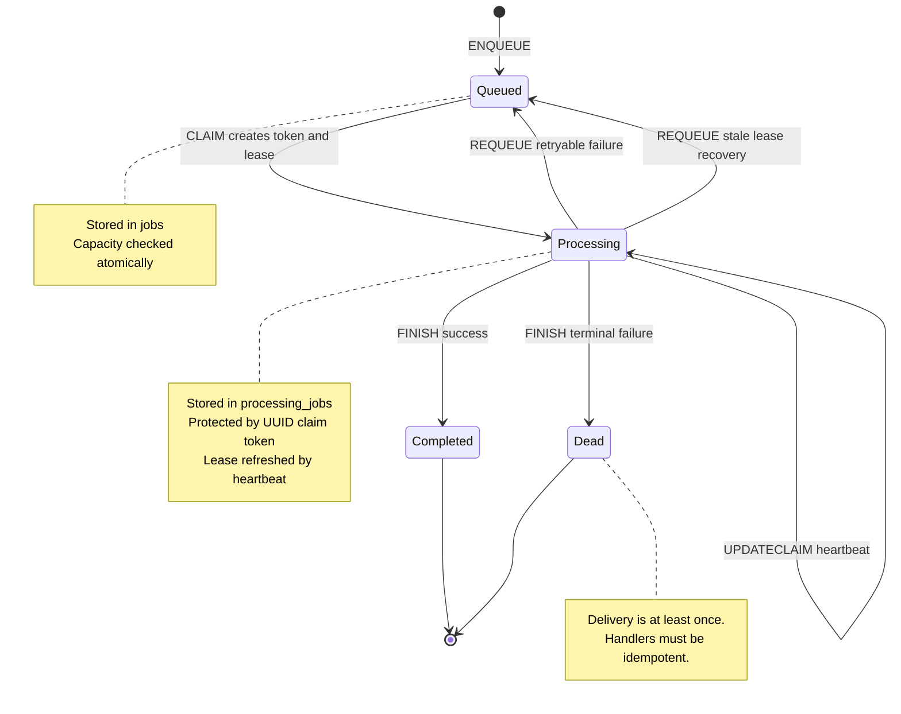
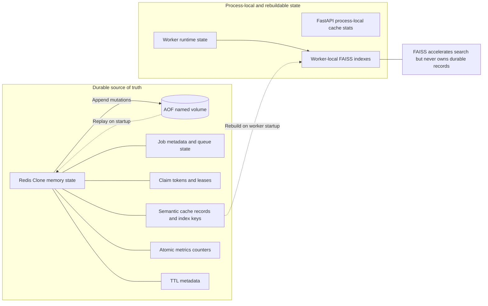

# Architecture

This document contains the detailed architecture for the Mini Redis AI Infrastructure Platform.

For a high-level overview, see README.md.
---

# System Overview



---

# End-to-End Request Flow

The following sequence shows the complete lifecycle of an inference request.



This flow demonstrates the interaction between the API layer, queueing system, worker infrastructure, semantic cache, vector search layer, and persistence layer.

---

# Service Responsibilities

## FastAPI

Responsible for:

* Request validation
* Job creation
* Job lookup
* Metrics exposure
* Health checks

FastAPI does not perform inference directly.

All inference work is delegated to workers.

---

## Redis Clone

Redis Clone is the durable source of truth.

Stores:

```text
Jobs
Queue state
Semantic cache metadata
Metrics
TTL data
Application state
```

Responsibilities:

```text
TCP networking
RESP parsing
Persistence
Atomic queue operations
Concurrency control
```

---

## Worker

Workers perform asynchronous processing.

Responsibilities:

```text
Claim jobs
Maintain leases
Send heartbeats
Recover stale jobs
Execute inference
Update semantic cache
Update metrics
```

Workers are intentionally stateless except for FAISS indexes.

---

# Queue Architecture

## Queues

```text
jobs
processing_jobs
dead_jobs
```

---

## Job Lifecycle



---

## Claim Tokens

Every claimed job receives:

```text
worker_id
claim_token
claimed_at
lease_seconds
```

Example:

```json
{
  "worker_id": "worker-1",
  "claim_token": "uuid",
  "claimed_at": "...",
  "lease_seconds": 60
}
```

Protected operations:

```text
ACK
FINISH
REQUEUE
UPDATECLAIM
```

Only the worker possessing the matching claim token may modify the claim.

---

## Worker Leases

Workers claim jobs with a lease.

```text
Claim
 ↓
Lease Starts
 ↓
Heartbeat
 ↓
Lease Extended
```

Purpose:

```text
Detect abandoned claims
Allow stale-job recovery
```

---

## Recovery Flow

```text
Worker Crash
      ↓
Lease Expires
      ↓
Recovery Scan
      ↓
REQUEUE
      ↓
Available Again
```

Delivery semantics:

```text
At Least Once
```

---

# Semantic Cache Architecture

## Goal

Reduce repeated inference cost.

Instead of:

```text
Prompt equality
```

Use:

```text
Embedding similarity
```

---

## Cache Flow

```text
Prompt
   ↓
Embedding Generation
   ↓
Vector Search
   ↓
Similarity Threshold
   ↓
Hit / Miss
```

---

## Cache Entry Structure

```json
{
  "entry_id": "...",
  "prompt": "...",
  "provider": "...",
  "model_id": "...",
  "model_revision": "...",
  "embedding_dimensions": 384,
  "embedding": [...],
  "response": {...}
}
```

---

# Data Ownership



Redis Clone and its AOF own durable application state. Each worker owns an
independent FAISS index that can be discarded and rebuilt from semantic cache
records.

---

# Vector Search

## Linear Search

Implementation:

```text
Cosine similarity against every embedding.
```

Complexity:

```text
O(n)
```

Used for:

```text
Testing
Validation
Fallback behavior
```

---

## FAISS Search

Implementation:

```text
IndexFlatIP
```

Embeddings are normalized before insertion.

Similarity:

```text
Cosine similarity
```

via normalized inner product.

---

# FAISS Signature Isolation

Separate indexes exist for:

```text
provider
model_id
model_revision
embedding_dimensions
```

Signature:

```python
(
    provider,
    model_id,
    model_revision,
    dimensions,
)
```

This prevents incompatible embedding spaces from mixing.

---

# FAISS Rebuild Strategy

Redis remains the source of truth.

FAISS stores only search structures.

Startup:

```text
Worker Startup
      ↓
Read semantic_cache:index
      ↓
Load Entries
      ↓
Validate Signatures
      ↓
Build FAISS Indexes
```

If FAISS is lost:

```text
Delete FAISS
      ↓
Restart Worker
      ↓
Automatic Rebuild
```

No semantic cache data is lost.

---

# Metrics Architecture

Metrics are stored inside Redis Clone.

The observability path is:

```text
Redis-backed counters
        ↓
FastAPI /metrics
        ↓
Prometheus
        ↓
Grafana dashboard
```

Structured JSON logs complement the metrics with `request_id` and `job_id`
correlation across API and worker events. Docker captures and rotates these
logs using the `json-file` driver.

Counters:

```text
processed_jobs
failed_jobs

semantic_cache_hits
semantic_cache_misses

faiss_search_count
linear_search_count

provider_call_count
```

Atomic operations:

```text
INCR
INCRBY
```

---

## Metrics Endpoints

JSON:

```http
GET /jobs/metrics
```

Prometheus:

```http
GET /metrics
```

## Structured Logging

Application logs are emitted as JSON to standard output and captured by
Docker's `json-file` logging driver with size-based rotation.

Correlation follows this path:

```text
API request_id
      ↓ persisted in job metadata
job_id
      ↓ claimed by
worker_id
      ↓
cache, provider, completion, retry, or failure events
```

Representative events include:

```text
request_completed
request_failed
job_enqueued
job_claimed
job_started
semantic_cache_hit
semantic_cache_miss
job_requeued
job_finished
job_failed
stale_job_recovered
redis_connection_lost
redis_connection_restored
```

Claim tokens, prompts, embeddings, responses, and common secret fields are
redacted by the shared formatter. Logs remain local to Docker for now and can
later be shipped to CloudWatch without changing application event structure.

---

# Persistence

Persistence uses Append Only Files.

Every mutating operation:

```text
SET
DELETE
MSET
LPUSH
CLAIM
FINISH
REQUEUE
INCR
INCRBY
...
```

is appended to disk.

Startup:

```text
Replay AOF
      ↓
Reconstruct State
```

---

# Testing Strategy

Coverage areas:

```text
Protocol parsing
Persistence
TTL
Queue operations
Lease recovery
Semantic cache
FAISS rebuild
Metrics
API endpoints
```

The project maintains a comprehensive automated test suite covering protocol parsing, persistence, queue processing, semantic caching, metrics, and API behavior.

---

# Design Principles

1. Redis Clone is the source of truth.
2. Workers are disposable.
3. FAISS is rebuildable.
4. Queue operations are token protected.
5. Metrics use atomic counters.
6. Semantic cache is provider/model isolated.
7. Recovery is automatic after worker failure.

---

# Architectural Tradeoffs

The platform intentionally favors simplicity and observability over maximum scalability.

Current tradeoffs include:

* Redis Clone remains the source of truth for all application state.
* FAISS indexes are treated as rebuildable acceleration structures.
* Queue delivery semantics are at-least-once rather than exactly-once.
* Metrics are stored directly in Redis Clone using atomic counters.
* Workers are designed to be disposable and recoverable.
* Deployments currently target a single EC2 instance.
* Semantic cache isolation prioritizes correctness over index sharing.

These decisions reduce system complexity while preserving durability, recoverability, and debuggability.

---

# AWS Deployment Architecture

The deployed version runs on a single AWS EC2 instance.

```text
Developer Machine
      │
      │ SSH
      ▼
AWS EC2 Instance
      │
      ├── Docker Compose
      │
      ├── FastAPI Container
      │
      ├── Redis Clone Container
      │
      └── Worker Container
```

## EC2 Runtime

The EC2 instance runs:

```text
Ubuntu Server 24.04 LTS
Docker
Docker Compose
```

The application is deployed using:

```bash
docker-compose -f docker-compose.prod.yml up -d
```

## Network Boundary

Only the FastAPI service is exposed externally.

```text
Internet / Developer IP
          │
          ▼
EC2 Security Group
          │
          ▼
Port 8000
          │
          ▼
FastAPI Container
```

Redis Clone is not exposed publicly.

```text
Redis Clone Port 31337
Internal Docker network only
```

This keeps the datastore accessible to the API and worker containers while preventing direct external access.

## Container Boundary

```text
FastAPI Container
  - HTTP API
  - Job creation
  - Metrics endpoints

Redis Clone Container
  - TCP datastore
  - Queue state
  - AOF persistence
  - Metrics counters

Worker Container
  - Job processing
  - Hugging Face embeddings
  - FAISS indexes
  - Semantic cache updates
```

The worker owns the heavy ML dependencies. The API and Redis containers remain lightweight.

## Deployment Flow

Manual deployment flow:

```text
SSH into EC2
      ↓
git pull origin main
      ↓
docker-compose -f docker-compose.prod.yml down
      ↓
docker-compose -f docker-compose.prod.yml build
      ↓
docker-compose -f docker-compose.prod.yml up -d
      ↓
curl /health
```

GitHub Actions deployment flow:

```text
Run Deploy workflow
      ↓
GitHub Actions connects to EC2 over SSH
      ↓
Pulls latest main branch
      ↓
Rebuilds Docker images
      ↓
Restarts containers
      ↓
Runs health check
```

The deploy workflow is manual-only for now because the EC2 instance is stopped when not in use to avoid unnecessary AWS charges.

---

# Diagram Sources

Editable Mermaid sources for the diagrams in this document are stored in
[`docs/diagrams/`](docs/diagrams/):

* [`system-architecture.mmd`](docs/diagrams/system-architecture.mmd)
* [`inference-sequence.mmd`](docs/diagrams/inference-sequence.mmd)
* [`queue-lifecycle.mmd`](docs/diagrams/queue-lifecycle.mmd)
* [`data-ownership.mmd`](docs/diagrams/data-ownership.mmd)

The `.mmd` files contain raw Mermaid syntax so they can be rendered by Mermaid
CLI or exported to SVG and PNG without stripping Markdown fences.
