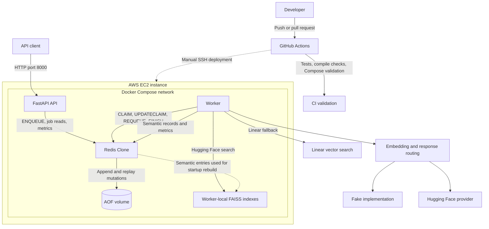
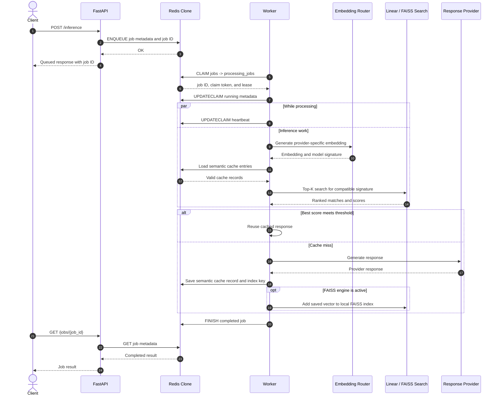
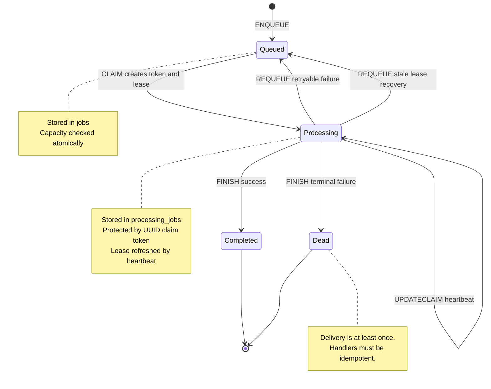
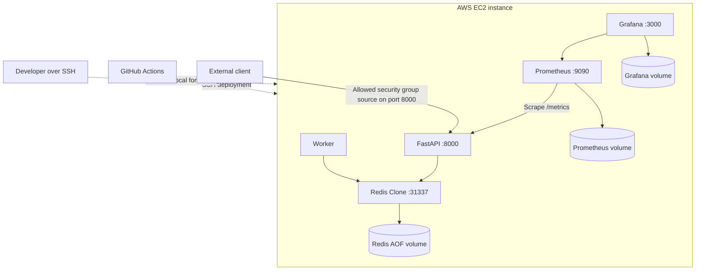

# Architecture

This document describes the system boundaries, ownership model, guarantees,
failure behavior, and tradeoffs of the Mini Redis AI Infrastructure Platform.

For a high-level project overview and quick start, see [README.md](README.md).

---

## Contents

- [Design Goals and Non-Goals](#design-goals-and-non-goals)
- [System Invariants](#system-invariants)
- [System Overview](#system-overview)
- [End-to-End Request Flow](#end-to-end-request-flow)
- [Service Responsibilities](#service-responsibilities)
- [Queue Architecture](#queue-architecture)
- [Concurrency and Atomicity](#concurrency-and-atomicity)
- [Semantic Cache Architecture](#semantic-cache-architecture)
- [Data Ownership](#data-ownership)
- [Vector Search](#vector-search)
- [Metrics and Logging Architecture](#metrics-and-logging-architecture)
- [Persistence and Recovery](#persistence-and-recovery)
- [Architectural Tradeoffs](#architectural-tradeoffs)
- [Deployment and Trust Boundaries](#deployment-and-trust-boundaries)
- [Failure Modes](#failure-modes)
- [Validation Strategy](#validation-strategy)
- [Diagram Sources](#diagram-sources)

---

## Design Goals and Non-Goals

### Goals

- Preserve application state through append-only persistence.
- Recover in-flight work after worker crashes or lease expiration.
- Keep Redis Clone as the authoritative state store.
- Treat FAISS indexes as rebuildable acceleration structures.
- Make queue, cache, provider, and worker behavior observable.
- Isolate heavy ML dependencies to the worker service.
- Keep deployment simple enough to inspect and operate on one EC2 instance.

### Non-Goals

- Full Redis protocol or command compatibility
- A production Redis replacement
- Exactly-once job delivery
- Distributed consensus
- Multi-node high availability
- Multi-region deployment
- Zero-downtime deployment

---

## System Invariants

The architecture relies on these invariants:

1. Redis Clone is authoritative in memory, and commands successfully appended
   to the AOF are the durable recovery source.
2. FAISS indexes never own durable application data.
3. Workers may restart and rebuild local FAISS indexes from Redis records.
4. Mutations to claimed jobs require the current claim token; stale or missing
   tokens cannot update, requeue, acknowledge, or finish a claim.
5. Expired claims are recoverable through stale-claim scans.
6. Queue delivery is at least once; job handlers must tolerate retries.
7. Metrics counters are updated through atomic Redis Clone commands.
8. Semantic cache entries never cross provider, model ID, model revision, or
   embedding-dimension boundaries.
9. API and Redis Clone processes do not import worker-only ML dependencies.

---

## System Overview



---

## End-to-End Request Flow

The following sequence shows the complete lifecycle of an inference request.



This flow demonstrates the interaction between the API layer, queueing system, worker infrastructure, semantic cache, vector search layer, and persistence layer.

---

## Service Responsibilities

| Service | Responsibilities | State ownership |
|---|---|---|
| FastAPI | Validate requests, atomically enqueue jobs, expose status, health, and metrics | No authoritative application state |
| Redis Clone | RESP parsing, shared state, TTLs, atomic queue transitions, counters, AOF persistence | Durable source of truth |
| Worker | Claims, leases, recovery, embeddings, vector search, provider calls, cache writes, metrics | Runtime state and rebuildable FAISS indexes |
| Prometheus | Scrape and retain exported metrics | Named metrics volume |
| Grafana | Query Prometheus and render dashboards | Named dashboard volume |

FastAPI never performs inference directly. Workers are disposable except for
their process-local FAISS projections, which are reconstructed from Redis.

---

## Queue Architecture

### Queues

```text
jobs
processing_jobs
dead_jobs
```

---

### Job Lifecycle



---

### Claim Tokens

Every claimed job receives:

```text
worker_id
claim_token
claimed_at
lease_seconds
```

Example:

```json
{
  "worker_id": "worker-1",
  "claim_token": "uuid",
  "claimed_at": "...",
  "lease_seconds": 60
}
```

Protected operations:

```text
ACK
FINISH
REQUEUE
UPDATECLAIM
```

Only the worker possessing the matching claim token may modify the claim.

---

### Worker Leases

Claims include a time-based lease. Workers periodically refresh the claim and
job metadata with `UPDATECLAIM`. If a worker crashes or stops heartbeating, a
recovery scan can identify the expired claim and make the job available again.

---

### Recovery Flow

If a worker crashes while processing a job, the claim remains in
`processing_jobs` until its lease expires. A recovery scan validates the stale
claim token, resets the job metadata, and atomically moves the job back to
`jobs`. Another worker may then claim it.

This provides at-least-once delivery. A worker can continue running after its
lease expires, so duplicate execution remains possible and handlers must be
idempotent.

---

## Concurrency and Atomicity

The TCP server accepts multiple clients through a bounded gevent connection
pool. Mutating commands protect shared in-memory dictionaries and lists with a
server-wide reentrant lock. Compound queue commands perform their related state
changes and AOF append while holding that lock.

| Command | Protected state transition |
|---|---|
| `ENQUEUE` | Check capacity, store job metadata, and push the job ID |
| `CLAIM` | Move a job to processing and create token/lease metadata |
| `UPDATECLAIM` | Validate the token and refresh job and claim metadata |
| `REQUEUE` | Validate the token, update metadata, and move the job to `jobs` |
| `FINISH` | Validate the token, persist terminal metadata, remove the claim, and optionally push to `dead_jobs` |
| `ACK` | Validate the token and remove processing/claim state |
| `INCR` / `INCRBY` | Read, modify, persist, and return a counter |

The Redis client also serializes each socket request/response cycle with a
reentrant lock so concurrent API threads cannot interleave RESP frames on one
connection.

These guarantees prevent partially applied in-memory queue transitions and
lost counter updates. They do not provide distributed transactions,
exactly-once execution, or atomicity across multiple client commands.

---

## Semantic Cache Architecture

The semantic cache reuses responses based on embedding similarity rather than
exact prompt equality. A worker embeds the query, searches only compatible
entries, and accepts the best result when its score meets
`SEMANTIC_CACHE_THRESHOLD`. A miss invokes the provider and persists a new
record.

### Cache Entry

```json
{
  "entry_id": "...",
  "prompt": "...",
  "provider": "...",
  "model_id": "...",
  "model_revision": "...",
  "embedding_dimensions": 384,
  "embedding": [...],
  "response": {...}
}
```

Entries are validated before use. Provider, model ID, model revision, and
embedding dimensions define compatibility; malformed, stale, or incompatible
records are skipped. UUID keys avoid collisions, duplicate prompt/model entries
are not rewritten, and retention pruning bounds indexed growth.

---

## Data Ownership


Redis Clone and its AOF own durable application state. Each worker owns an
independent FAISS index that can be discarded and rebuilt from semantic cache
records.

---

## Vector Search

The worker supports two exact search paths:

| Engine | Implementation | Role |
|---|---|---|
| Linear | Python cosine-similarity scan, `O(n)` | Baseline, testing, fallback |
| FAISS | Normalized vectors in `IndexFlatIP` | Worker-local accelerated Top-K search |

Normalized inner product is used as cosine similarity. Separate FAISS indexes
are keyed by this signature:

```python
(
    provider,
    model_id,
    model_revision,
    dimensions,
)
```

This prevents incompatible embedding spaces from mixing. At startup, the
worker reads `semantic_cache:index`, validates each record, groups entries by
signature, and rebuilds the corresponding indexes. Losing FAISS state does not
lose semantic-cache data.

---

### FAISS Consistency Model

Each worker owns an independent in-memory FAISS index. On startup, a worker
builds indexes from semantic cache records visible in Redis. After a cache
miss, that worker adds the newly saved entry to its own index.

With multiple workers, indexes can temporarily diverge because local FAISS
updates are not broadcast between processes. Redis remains authoritative; a
restart or explicit rebuild repairs a worker's local projection.

Semantic cache persistence is a multi-command workflow:

1. Store `semantic_cache:<uuid>`.
2. Push the key into `semantic_cache:index`.
3. Prune records beyond the configured limit.
4. Add the vector to the local FAISS index.

These steps are not one transaction. A crash between the record write and
index-list update can leave an unindexed record. A failure after Redis writes
but before FAISS insertion leaves durable data that can be recovered during a
later worker rebuild.

---

## Metrics and Logging Architecture

Metrics counters are stored in Redis Clone and exported by FastAPI:

```text
Redis-backed counters
        ↓
FastAPI /metrics
        ↓
Prometheus
        ↓
Grafana dashboard
```

`INCR` records event counts and `INCRBY` records integer latency totals.
FastAPI derives averages and cache-hit rate from those cumulative values.
Queue depths are read directly from list lengths.

| Endpoint | Format | Consumer |
|---|---|---|
| `GET /jobs/metrics` | JSON | Humans and API clients |
| `GET /metrics` | Prometheus text | Prometheus and Grafana |

### Structured Logging

API, worker, and Hugging Face provider events are emitted as JSON to standard
output and captured by Docker with size-based rotation. Correlation follows:

```text
API request_id
      ↓ persisted in job metadata
job_id
      ↓ claimed by
worker_id
      ↓
cache, provider, completion, retry, or failure events
```

Representative events include request completion/failure, enqueue, claim,
worker start, semantic hit/miss, provider completion, requeue, terminal
completion/failure, stale recovery, and Redis reconnects.

Claim tokens, prompts, embeddings, responses, and common secret fields are
redacted by the shared formatter. Logs remain local to Docker for now and can
later be shipped to CloudWatch without changing application event structure.

---

## Persistence and Recovery

Redis Clone persists mutating operations as RESP command arrays in an
append-only file stored on a named Docker volume. RESP framing preserves
arbitrary bytes and spaces without relying on ad hoc command parsing.

Persisted operations include key/value and list mutations, absolute expiration
timestamps, queue transitions, claim heartbeats, terminal job updates, and
metrics counters.

### Write Path

Each mutating handler:

1. Validates arguments before changing shared state.
2. Acquires the server's reentrant lock.
3. Applies the in-memory transition.
4. Appends the corresponding command to the AOF before releasing the lock.

The implementation opens the AOF in append mode for each command but does not
call `fsync`. It reconstructs commands successfully written before restart,
but does not claim power-loss durability for data still buffered by the
operating system or storage device.

### Replay

At startup, the server reads RESP commands sequentially and dispatches them
through normal command handlers. Replay mode suppresses AOF writes so
restoration does not duplicate records.

If replay reaches a malformed or crash-truncated frame, it stops before
applying that command. Valid commands before the damaged frame remain restored;
commands after the first damaged frame are not replayed.

### TTL Semantics

`SET ... EX` is persisted as a value write followed by `EXPIREAT` with the
original absolute timestamp. Restart therefore preserves the remaining
lifetime instead of resetting the relative TTL. Already expired keys are not
restored.

### Persistence Limits

- AOF rewrite and compaction are not implemented.
- There are no snapshots, replication, checksummed segments, or automatic
  backup verification.
- In-memory mutation and AOF append are protected by one process lock but do
  not form a storage transaction with rollback.
- Replay terminates at the first malformed frame instead of attempting to
  discover an uncertain later command boundary.

---

## Architectural Tradeoffs

The platform intentionally favors simplicity and observability over maximum scalability.

Current tradeoffs include:

* Redis Clone remains the source of truth for all application state.
* FAISS indexes are treated as rebuildable acceleration structures.
* Queue delivery semantics are at-least-once rather than exactly-once.
* Metrics are stored directly in Redis Clone using atomic counters.
* Workers are designed to be disposable and recoverable.
* Deployments currently target a single EC2 instance.
* Semantic cache isolation prioritizes correctness over index sharing.

These decisions reduce system complexity while preserving durability, recoverability, and debuggability.

---

## Deployment and Trust Boundaries

The deployed version runs on a single AWS EC2 instance.



### EC2 Runtime

The host runs Ubuntu Server 24.04 LTS, Docker, and Docker Compose. Application
services are defined in `docker-compose.prod.yml`.

### Network Boundary

Only FastAPI port `8000` is published externally. Redis Clone port `31337`
remains inside the Docker network. Prometheus `9090` and Grafana `3000` bind to
the EC2 loopback interface and are accessed through SSH port forwarding.

SSH access is controlled by the EC2 security group. Deployment credentials are
stored as GitHub Actions secrets and are not committed to the repository.

### Container and Dependency Boundary

| Container | Responsibility |
|---|---|
| FastAPI | HTTP validation, enqueue, job reads, health, metrics |
| Redis Clone | TCP datastore, queue state, AOF, counters |
| Worker | Claims, embeddings, provider execution, FAISS, cache updates |
| Prometheus | Scrapes and retains `/metrics` |
| Grafana | Queries Prometheus and stores dashboard state |

The worker owns Hugging Face, CPU-only PyTorch, sentence-transformer, and FAISS
dependencies. API and Redis images remain lightweight and do not import worker
modules during startup.

Claim tokens behave like authorization credentials for in-flight jobs. They
are validated by Redis Clone commands and excluded from structured logs.

### Deployment Flow

```text
Manual GitHub Actions dispatch
      ↓
SSH to EC2 using repository secrets
      ↓
git pull --ff-only origin main
      ↓
compose down → build → up -d
      ↓
poll /health and print logs on failure
```

The deploy workflow is manual-only. It stops the current stack before building
and starting the replacement, then polls `/health`. This is operationally
simple but not zero downtime.

---

## Failure Modes

### Worker Crash

If a worker crashes after claiming a job, the job remains in
`processing_jobs` until its lease expires. A stale-claim scan can requeue it so
another worker processes it. The original worker may have produced side
effects before crashing, so duplicate execution remains possible.

### Redis Clone Restart

Redis Clone reconstructs state by replaying commands successfully appended to
the AOF. This includes key/value and list state, queue transitions, claim
metadata, semantic cache records, absolute TTL metadata, and metrics counters.
A malformed final frame is ignored together with anything after it.

### FAISS Index Loss or Divergence

FAISS indexes are process-local projections. A restarting worker reloads
compatible Redis records and rebuilds each provider/model/revision/dimension
index. Multiple live workers can temporarily hold different index contents;
Redis remains the repair source.

### Semantic Cache Partial Write

Saving the entry record, pushing its key into `semantic_cache:index`, pruning,
and adding it to FAISS are separate steps. A failure can leave an orphaned
record or a durable record missing from the local FAISS index. Cache misses
remain safe because the provider can still execute, and a worker rebuild can
repair Redis-backed FAISS state. Automatic orphan reconciliation is not yet
implemented.

### Provider Failure

A retryable provider or processing exception causes the current claim to be
requeued with updated attempt metadata. After the configured attempt limit,
`FINISH` stores terminal failure metadata and moves the job to `dead_jobs`.

### API or Redis Connectivity Failure

FastAPI holds no authoritative local copy of job state. If Redis Clone is
unavailable, health becomes degraded and queue/status operations fail rather
than silently accepting work that cannot be persisted. Workers log connection
loss and retry connection establishment.

### Deployment Failure

The workflow runs `compose down` before image build and startup. A build,
configuration, or health-check failure can therefore leave the service
unavailable. The workflow prints container status and logs, but automatic
rollback and zero-downtime replacement are not implemented.

---

## Validation Strategy

Automated coverage includes:

```text
RESP parsing and request limits
AOF replay and truncated-record handling
TTL persistence
Atomic queue transitions
Claim tokens, leases, heartbeats, and recovery
Semantic cache validation and pruning
FAISS isolation, rebuilds, and nearest-neighbor behavior
Metrics and structured logging
API request validation and job creation
```

The deployed semantic-cache path is also exercised with
[`benchmarks/demo_semantic_cache.py`](benchmarks/demo_semantic_cache.py). This
is an end-to-end functional workload, not a capacity benchmark.

| Phase | Validates |
|---|---|
| Cold seeds | Cache-miss and provider-call path |
| Semantic paraphrases | Embedding similarity and threshold behavior |
| Exact repeats | Deterministic cache reuse |
| Negative controls | Protection against unrelated false-positive hits |
| Queue burst | Atomic enqueue, claim, processing, and completion |

A recorded 46-request run completed every job with 26 cache hits, 20 misses,
zero negative-control false positives, zero exact-repeat misses, and zero failed
or dead jobs. The script captures before/after metric deltas because Redis and
Prometheus counters are cumulative.

This validates functional behavior and recovery boundaries. It does not
establish maximum throughput, multi-host scalability, or power-loss durability.

---

## Diagram Sources

Editable Mermaid sources for the diagrams in this document are stored in
[`docs/diagrams/`](docs/diagrams/):

* [`system-architecture.mmd`](docs/diagrams/system-architecture.mmd)
* [`inference-sequence.mmd`](docs/diagrams/inference-sequence.mmd)
* [`queue-lifecycle.mmd`](docs/diagrams/queue-lifecycle.mmd)
* [`data-ownership.mmd`](docs/diagrams/data-ownership.mmd)

The `.mmd` files contain raw Mermaid syntax so they can be rendered by Mermaid
CLI or exported to SVG and PNG without stripping Markdown fences.
